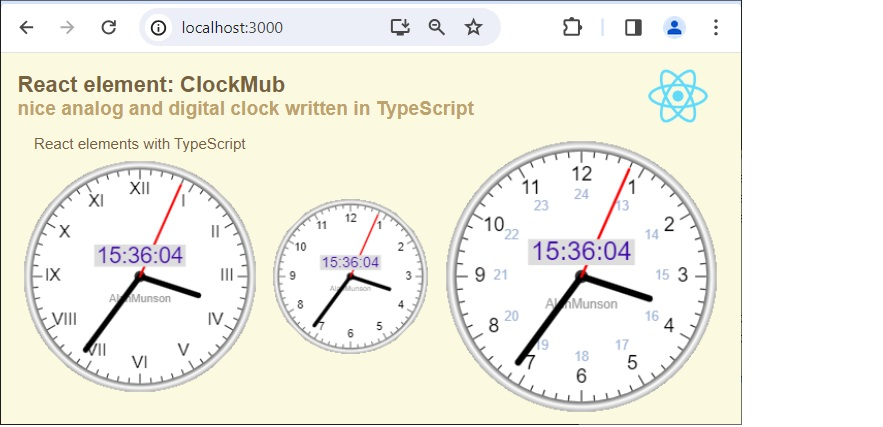

# React nice analog/digital clock in TS

React element: ClockMub: nice analog and digital clock written in TypeScript
This page demonstrates using React component - analog and digital clock with a round dial. 

- Project React with NPM tools, created by toolkit: create-react-app;
- This project requires instalation libraries by NPM tools, and compilation;
- In MClock.tsx defined main "ClockMub" React component;
- This is a Class_Component with JSX syntax;
- The clock is drawn using several procedures on the browser canvas;
- ClockMub software is developed from the author's version;
- Index.tsx renders three clocks (three instances of class ClockMub) each with a different size;
- Npm instaled local libraries: react v18.2, react-dom v18.2, react-scripts v5.0 with babel-loader v8.3;
- Project written in Visual Studio Code.

.

## Details

The application is initiated by the toolchain [Create React App], which creates files and the application operating environment. The startup script [….\node_modules\react-scripts\scripts\start.js] starts a local web server, embeds the project files (html, css, js) and starts public/index.html along with the compiled js files.
